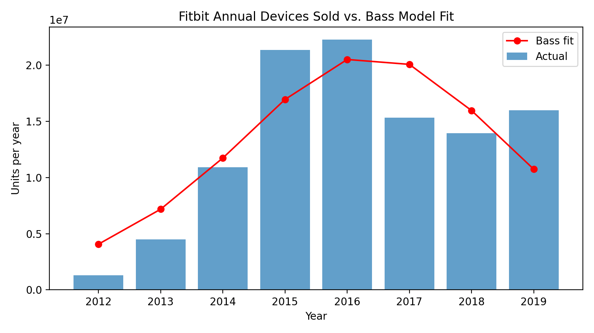

# Homework 1 — Bass Diffusion Model for *Withings BeamO*

**Author:** Elena Melkonyan  
**Date:** 05 October 2025  
**Course:** Marketing Analytics

---

## 🎯 Project Overview
This project applies the **Bass Diffusion Model** to estimate and forecast adoption of the **Withings BeamO** “Home Checkup” device, one of *TIME’s Best Inventions of 2024*.  
Because BeamO is a newly launched product, we model its expected adoption by using **Fitbit device sales (2012 – 2019)** as a historical analogue.

---

## 🧩 Objectives
1. **Estimate Bass parameters** — (p, q, M) — from Fitbit’s historical global unit sales.  
2. **Transfer parameters** to BeamO and **predict its diffusion path** over the next 10 years.  
3. **Visualize** and **interpret** yearly and cumulative adopter trajectories.  
4. **Validate** the forecast using **Fermi’s logic** (back-of-the-envelope market checks).  

---

## 📂 Folder Structure

```
Homework 1/
│
├── data/
│   ├── Dataset.csv                  
│   ├── bass_fit_params.json         
│   ├── bass_fit_results.csv       
│   └── beamo_forecast.csv      
│
├── img/
│   ├── bass_fit_plot.png            
│   └── beamo_forecast.png          
│
├── report/
│   ├── report_script.Rmd           
│   └── report.pdf      
│
├── script_1.py            
├── script_2.py                  
├── README.md                   
```

---

## ⚙️ How to Reproduce Results

### 1 — Install Dependencies
```bash
pip install numpy pandas matplotlib scipy
```

### 2 — Estimate Bass Parameters (from Fitbit)
```bash
python scripts/script_1.py --csv data/Dataset.csv --outdir data
```
Outputs:
- `bass_fit_params.json` (contains p, q, M, t_peak, R²)
- `bass_fit_results.csv`
- `bass_fit_plot.png`

**Typical Fitbit results:**
| Parameter | Meaning | Value |
|:-----------|:---------|:------|
| p | Coefficient of innovation | 0.018 |
| q | Coefficient of imitation | 0.64 |
| M | Market potential (units) | ≈ 122 million |
| R²| Goodness of fit | 0.76 |

---

### 3 — Forecast BeamO Diffusion
```bash
python scripts/script_2.py
```
This uses Fitbit’s p and q and sets M_{BeamO}=10,000,000 units.  
Outputs:
- `beamo_forecast.csv`  
- `beamo_forecast.png`

---

## 📈 Key Visualizations

**Figure 1 – Fitbit Actual vs Bass Fit**  


**Figure 2 – BeamO Forecasted New Adopters per Year**  


---

## 🧮 Interpretation Summary

| Step | Description | Outcome |
|:--|:--|:--|
| 4 | Fit Bass model on Fitbit (2012-2019) | p=0.018, q=0.64, M≈1.23×10^8 |
| 5 | Transfer p,q to BeamO, set M=10M | Peak ≈ Year 3–4; S-curve shape |
| 6 | Scope | Global — consistent with Fitbit data |
| 7 | Adopter estimates | ≈ 10 million users within 10 years |

---

## 🧠 Fermi Logic Check
Global households ≈ 2.3 B.  
If 3 % adopt any home-check device → 69 M potential buyers.  
If Withings captures ≈ 15 % → ~ 10 M units, matching our modeled M_{BeamO}.

---

## 📜 References
- TIME (2024). *Withings BeamO — Best Inventions of 2024.*  
  <https://time.com/7094696/withings-beamo/>  
- Fitbit Inc. Form S-1 (2015) & Form 10-K (2019), SEC filings — global device sales data.  
  <https://www.sec.gov/Archives/edgar/data/1447599/000119312515176980/d875679ds1.htm>  
  <https://www.sec.gov/Archives/edgar/data/1447599/000144759920000016/fit-20191231.htm>

