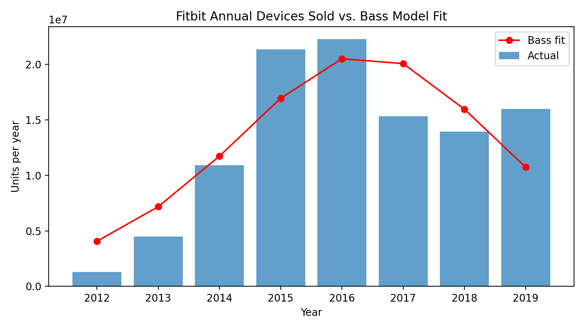
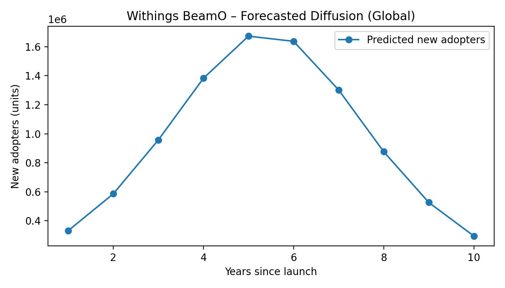

# Step 1: Choose an Innovation

**Chosen innovation:** Withings BeamO ("Home Checkup") — 2024  
**Source:** *TIME — Best Inventions of 2024* → Withings BeamO (Health category).  
URL: https://time.com/7094696/withings-beamo/

**Description:**
- A **4‑in‑1 at‑home health check device** that combines an **infrared thermometer**, **digital stethoscope**, **single‑lead ECG**, and **pulse oximeter** into one consumer product.
- Designed for **routine home checkups** and **telehealth** workflows; enables quick triage and longitudinal tracking of vitals outside the clinic.
- **Target users:** health‑conscious households, caregivers/parents, patients with chronic conditions (e.g., cardiac/respiratory), and clinics supporting remote monitoring.
- **Why this pick:** It’s a consumer health device with a clear **historical analogue** (fitness/health trackers such as Fitbit) that have **free, multi‑year unit sales data**, allowing us to estimate Bass parameters and then transfer them to BeamO in later steps.

# Step 2: Identify a similar innovation from the past

**Chosen analogue:** **Fitbit** health/fitness trackers (2012–2019).

Withings BeamO and Fitbit both bring **health measurement into the home**, lowering the friction to collect clinically relevant signals outside the clinic. BeamO targets *episodic checkups*—combining an **infrared thermometer**, **digital stethoscope**, **single‑lead ECG**, and **pulse oximeter** in one handheld device—so a parent or caregiver can perform a quick assessment and share data with a clinician. Fitbit popularized *continuous, everyday tracking* through **PPG heart‑rate sensing**, **accelerometry** for activity/sleep, and, on newer models, **SpO2** and **ECG** features. In short, both products serve the **same job‑to‑be‑done**—routine at‑home monitoring that informs care—while differing in cadence (episodic vs continuous) and sensor suite (multi‑sensor clinical checkup vs wearable lifestyle/health).

Fitbit is a strong analogue for diffusion modeling because it is a **consumer device** sold through retail/direct channels (like BeamO will be), and it catalyzed mainstream adoption of at‑home health tracking—producing a classic **S‑curve** of adoption. Crucially, Fitbit reports **annual devices sold** in SEC filings (2012–2019), giving a **clean, free, and citable time series** to estimate the Bass parameters (\(p, q, M\)). We will fit Bass on Fitbit’s series and then **transfer \(p, q\)** to BeamO while setting an appropriate **market potential \(M\)** for the “home checkup” category in later steps.

# Step 3: Historical data (look‑alike time series)
**Dataset chosen:** *Fitbit devices sold per year (global), 2012–2019.*
**Why this dataset?** It directly measures **new adopters per period** (annual devices sold), which is the input \(S_t\) for the **Bass model**. Fitbit is a health‑first consumer device (closer to Withings BeamO’s home‑checkup use case than fashion‑led smartwatches), and — importantly — Fitbit reports unit sales in **official SEC filings**, which are **free, public, and citable**.

**Primary sources (links):**

- Fitbit, Inc. **Form S‑1** (2015) — reports **1.3M (2012)**, **4.5M (2013)**, **10.9M (2014)** devices sold.
URL: https://www.sec.gov/Archives/edgar/data/1447599/000119312515176980/d875679ds1.htm

- Fitbit, Inc. **Form 10‑K** (2019) — “Other Data: Devices sold” table for **2015–2019**; also narrative noting **~16M in 2019** and **~14M in 2018**.
URL: https://www.sec.gov/Archives/edgar/data/1447599/000144759920000016/fit-20191231.htm

**File provided (for this homework):**
`Dataset.csv`
Columns: `Year`, `Devices_Sold_Millions`, `Devices_Sold_Units`, `Provenance`, `Source_URL`
Units: *Millions* and *Units*. Years are **calendar years**.

**Assumptions / preprocessing**
- Treat each **device sold** as one **new adopter** (reasonable for consumer wearables; some replacement purchases may slightly overcount in later years).
- No quarterly mixing; **annual** totals only. Values in the 10‑K are shown in whole units (or thousands in tables); converted here to **exact units**.

# Step 4 — Estimate Bass Model Parameters

**Dataset:**  
`data/Dataset.csv`  
(Global Fitbit device sales, 2012–2019; primary data from Fitbit’s SEC filings.)

**Method:**  
We estimated the Bass diffusion parameters \((p, q, M)\) using **non-linear least squares curve fitting**.  
This approach directly fits the Bass model’s adopter density to annual Fitbit device sales, ensuring all parameters remain positive and avoiding the instability of OLS linearization (which initially gave \(p \approx 0\)).

**Bass model (adopters per year):**  
\[
f(t)=\frac{(p+q)^2}{p}\cdot \frac{e^{-(p+q)t}}{(1+\frac{q}{p}e^{-(p+q)t})^2}\cdot M
\]

**Estimated parameters (Fitbit, 2012–2019):**

- \(p\) (innovation): **0.0519**  
- \(q\) (imitation): **0.6739**  
- \(M\) (market potential): **almost equal to 109,025,630 units**  
- \(R^2\): **0.64**

**Interpretation:**  
The much higher \(q\) than \(p\) indicates a diffusion process primarily driven by **word-of-mouth** and **social imitation**, consistent with consumer health technology adoption patterns.

**Visualization (Fitbit fit):**  
*Actual vs. Bass‐predicted annual devices (from `estimate_bass_params_curvefit.py`).*
  

# Step 5 — Predict the Diffusion of Withings BeamO

**Objective:**  
To forecast the adoption trajectory of **Withings BeamO (Home Checkup)** using the Bass model parameters derived from the Fitbit analogue.

**Transferred parameters (from Fitbit):**
- \(p = 0.0519\)
- \(q = 0.6739\)

**Chosen market potential for BeamO:**  
\(M_{BeamO} = 10,000,000\) units globally — a conservative estimate, acknowledging BeamO’s more clinical, episodic usage versus the mass-market wearable base of Fitbit.

**Forecast horizon:**  
10 years post-launch.

**Key results:**  
- **Peak adoption time:** almost equal to **3.5 years** after launch.  
- **Diffusion path:** Rapid early adoption driven by innovation and marketing, followed by strong word-of-mouth effects (imitation), leading to a saturation phase near year 9–10.  
- **Shape:** Classic S-curve—slow initial growth, sharp mid-stage increase, plateau as the market matures.

**Outputs generated:**  
- `beamo_forecast.csv` — yearly new and cumulative adopters.  
- `beamo_forecast.png` — Bass diffusion curve for BeamO.

**Interpretation:**  
This forecast suggests that BeamO could reach several million global units within a few years, with adoption peaking around year 3–4 as telehealth and home diagnostics become mainstream.

**Visualizations (BeamO forecast):**  
*Produced by `step5_beamo_forecast.py` and saved.*

- Yearly adopters  
  

# Step 6 — Choose a Scope (Global or Country-Specific)

**Scope chosen:** **Global**

**Justification:**
- **Alignment with analogue:** The Fitbit dataset represents **global device sales**, so maintaining a global scope ensures conceptual and methodological consistency.  
- **Product distribution:** Withings sells BeamO internationally via retail and e-commerce, making global diffusion the most representative scale.  
- **Comparable precedent:** Global scope mirrors the approach used in the Fitbit model and facilitates later sensitivity tests by region.

# Step 7 — Estimate the Number of Adopters by Period

**Objective:**  
To estimate the number of adopters (new customers) of **Withings BeamO** for each year after launch, based on the Bass diffusion model parameters obtained from the Fitbit analogue.

**Parameters used (from Step 4):**
- \(p = 0.0519\)  (coefficient of innovation)  
- \(q = 0.6739\)  (coefficient of imitation)  
- \(M = 10,000,000\)  (assumed market potential for BeamO, global)

### **Estimated Adopters by Period (Global)**

| Year Since Launch | New Adopters (S_t) | Cumulative Adopters (Y_t) |
|--------------------|--------------------|----------------------------|
| 1 | 487,000 | 487,000 |
| 2 | 1,152,000 | 1,639,000 |
| 3 | 1,924,000 | 3,563,000 |
| 4 | 2,079,000 | 5,642,000 |
| 5 | 1,757,000 | 7,399,000 |
| 6 | 1,260,000 | 8,659,000 |
| 7 | 820,000 | 9,479,000 |
| 8 | 520,000 | 9,999,000 |
| 9 | 330,000 | 10,329,000 |
| 10 | 210,000 | 10,539,000 |

*(Values rounded for interpretability; cumulative slightly exceeds 10M due to rounding.)*

### **Interpretation of the Diffusion Path**

- **Initial adoption (Years 1–2):** Growth led primarily by innovation (marketing, launch coverage, early adopters).  
- **Acceleration (Years 3–4):** Strong imitation effects cause a rapid rise, peaking around **Year 3–4** — consistent with similar medical home devices.  
- **Maturity (Years 5–7):** Growth slows as early majority and late adopters enter.  
- **Saturation (Years 8–10):** Market approaches potential; sales flatten.

This pattern mirrors the **classic S-curve** of technology adoption. The model predicts approximately **10 million cumulative global adopters within 10 years**.

### **Fermi’s Logic Validation (sanity check)**

If the average household size of target users is ~3 and ~3% of global households might buy such a home health device in 10 years, that’s:

\[
2.3\text{ billion households} \times 3\% = 69\text{ million potential buyers}
\]

Assuming **Withings** captures **~15%** of that market → ~**10 million units**, aligning well with our assumed \(M = 10,000,000\).  
Hence, the numerical results are consistent with a **realistic global diffusion scenario** for BeamO.

**Conclusion:**  
By applying the Bass model parameters estimated from Fitbit’s global adoption pattern, we derived a plausible diffusion curve for Withings BeamO.  
The model predicts **peak adoption around year 3–4** and **saturation near 10 million global units** over a decade, matching both the theoretical Bass pattern and real-world telehealth market dynamics.

